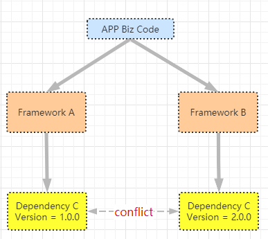
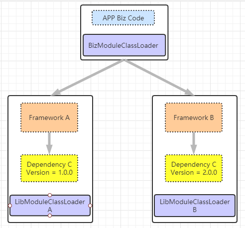

# Cabin

[](https://codecov.io/gh/esastack/esa-cabin)
[](https://maven-badges.herokuapp.com/maven-central/io.esastack/restlight-cabin/)
[](https://github.com/esastack/esa-cabin/blob/main/LICENSE)

Cabin是一款Java类隔离框架，用于隔离各个模块之间、模块和业务之间使用的第三方依赖库。使用Cabin后，模块SDK将只是用自己指定
版本的三方依赖，不会被业务引入的依赖所影响，保证业务正常运行，提高业务的开发效率，减少中间件同学此类重复的支持工作。

## 概述
ESA Cabin用于解决模块间类冲突。要解决的问题是，当一个应用项目中使用到了多个框架或者SDK(后续称为LibModule)时，
各个LibModule之间、LibModule和应用业务代码(后续称为BizModule)之间可能存在包冲突，即“使用了三方依赖的不兼容的不同版本”。
业务遇到包冲突的时候，需要进行进行复杂的排包工作和兼容性实验，以期待找到一个能兼容各个模块的依赖版本；当LibModule使用
了不兼容的三方依赖版本发布的时候，还需要多方协调。一旦遇到依赖冲突，将严重影响开发效率和体验。  

举例说明依赖冲突。假设如下场景，如果工程需要引入两个框架：FrameworkA 和 FrameworkB，其中 FrameworkA 需要依赖版本号为
 1.0.0 的 DependencyC， FrameworkB 需要依赖版本号为 2.0.0 的 DependencyC，而这两个版本无法兼容(例如类名、方法名、参数有
 变化或者增删)：
 


为了彻底解决包冲突的问题，需要借助类隔离机制，将各个Framework打包为一个LibModule，使用各自的 ClassLoader 加载，业务代码
使用单独的ClassLoader加载，达到相互隔离的目的:



## Quick Start
## LibModule开发者
框架、中间件、SDK可以打包为特定的格式，使用Cabin容器来和业务代码进行类隔离。

### 打包
> 目前只支持maven打包。

#### 打包插件
+ 使用cabin-module-maven-plugin插件打包
具体使用方式参考下文举例。

#### 单module项目打包
将一个module及其依赖打包。此种打包方式需要指定classifier(例子里有说明)，用户根据classifier来区分使用fatjar和普通jar。
此种打包方式会将module的所有maven依赖传递给使用者，使用者可以任意update/exclude这些依赖，不会影响module中的代码。
<br>
用esa-rpc-filter这个module举例：
```xml
...
<artifactId>esa-rpc-cluster</artifactId>
...
<dependencies>
    ...
</dependencies>

<build>
    <plugins>
        <plugin>
            <groupId>io.esastack</groupId>
            <artifactId>cabin-module-maven-plugin</artifactId>
            <version>${cabin.version}</version>
            <executions>
                <execution>
                    <id>default-cli</id>
                    <goals>
                        <goal>module-repackage</goal>
                    </goals>
                    <configuration>
                        ## 一定要指定，否则会覆盖原有的标准jar包
			<classifier>cabin-module</classifier>
			## 需要导出的类、包、资源，一般使用package即可，资源一般是SPI的配置文件，Spring的xsd和spring.fatories文件等。
                        <exported>
                            <packages>
                                <package>esa.rpc.cluster</package>
                                <package>esa.commons.serialize</package>
                            </packages>
                            <resources>
                                <resource>META-INF/services/</resource>
                            </resources>
                        </exported>

                        ##imported的类是指被打包的模块需要优先从业务classpath中加载的类，比如Spring一般是使用业务的依赖；如果模块需要通过方法的参数和返回值传递三方依赖的类和对象，也建议使用import的方式从业务classpath加载这些类(例如需要传递netty的ChannelHandlerContext)；提供了SPI接口的三方包，也建议从biz中import。
                        <imported>
                            <packages>
                                <package>javassist</package>
                                <package>org.springframework</package>
                            </packages>
                        </imported>
			##不影响使用的SPI，可以不import，在此处排除
 			<excludeCheckedSPIs>
			 	<excludeCheckedSPI>com.fasterxml.jackson.core.JsonFactory</excludeCheckedSPI>
                                <excludeCheckedSPI>io.grpc</excludeCheckedSPI>
                        </excludeCheckedSPIs>
                    </configuration>
                </execution>
            </executions>
        </plugin>
    </plugins>
</build>
```

#### 多module项目合并打包成All-In-One的FatJar
如果要将多个module项目合并打包成一个FatJar, 具体步骤如下:
+ 创建一个新module来依赖需要合并在一起的module，如xxx-cabin，在其pom中依赖此项目的所有其他module和额外需要的三方依赖；
+ 在xxx-cabin的pom中加入cabin-module-maven-plugin插件，并配置相关信息
<br>
下面用ESA RPC举例讲解如何打包：
+ esa-rpc-cabin (会传递三方依赖)
```xml
<dependencies>
    ...加入需要合并打包的module和依赖
</dependencies>

<build>
    <plugins>
        <plugin>
            <groupId>io.esastack</groupId>
            <artifactId>cabin-module-maven-plugin</artifactId>
            <version>${cabin.version}</version>
            <executions>
                <execution>
                    <id>default-cli</id>
                    <goals>
                        <goal>module-repackage</goal>
                    </goals>
                    <configuration>
			### 需要导出的类、包、资源，一般使用package即可，资源一般是SPI的配置文件，Spring的xsd和spring.fatories文件等。
                        <exported>
                            <packages>
                                <package>esa.rpc</package>
                                <package>esa.commons.serialize</package>
                            </packages>
                            <classes>
				<class>esa.rpc.filter.consumer.Async2SyncFlter</class>
                            </classes>
			    #
                            <resources>
                                <resource>META-INF/services/</resource>
                                <resource>META-INF/esa/</resource>
                                <resource>META-INF/esa-rpc.xsd</resource>
                                <resource>META-INF/spring.*</resource>
                                <resource>esa/rpc/spring/boot/autoconfigure/ESABeanConfiguration.class</resource>
                                <resource>esa/rpc/spring/boot/autoconfigure/banner/ESAWelcomeLogoApplicationListener.class</resource>
                            </resources>
                        </exported>

                        #imported的类是指被打包的模块需要优先从业务classpath中加载的类，比如Spring一般是使用业务的依赖；如果模块需要通过方法的参数和返回值传递三方依赖的类和对象，也建议使用import的方式从业务classpath加载这些类(例如需要传递netty的ChannelHandlerContext)；提供了SPI接口的三方包，也建议从biz中import。
                        <imported>
                            <packages>
                                <package>javassist</package>
                                <package>org.springframework</package>
                            </packages>
                        </imported>
                        ##开启检查SPI类的功能
                        <checkSPI>true</checkSPI>
			##在此处排除排除掉不必import的SPI类
 			<excludeCheckedSPIs>
			 	<excludeCheckedSPI>com.fasterxml.jackson.core.JsonFactory</excludeCheckedSPI>
                                <excludeCheckedSPI>io.grpc</excludeCheckedSPI>
                        </excludeCheckedSPIs>
                    </configuration>
                </execution>
            </executions>
        </plugin>
    </plugins>
</build>
```

#### SPI资源文件和相关类的处理
+ 如果SDK自定义了SPI接口或者实现了其他的SPI接口，这些类都需要配置为exported(一般在exported/packages/package中已经包含，不用额外配置)；
+ 如果SDK中引用了定义定实现了SPI接口的三方依赖，在启动的时候可能出现SPI接口和实现类不是一个ClassLoader加载的错误，此时建议import此三方依赖的类；
+ 可以开启checkSPI配置：会扫描所有依赖的SPI文件，如果SPI接口和实现类没被imported/exported则报错；如果确定不影响SDK使用的SPI，可以使用excludeCheckedSPIs/excludeCheckedSPI来跳过某个包或类的检查，具体的配置见上面的配置示例。

#### 多module项目，其中任意个数的modules组合打包
当一个项目中有多个modules，业务使用方可以根据需要引用其中的一个或者一些module的情况下，按照下面的原则配置

## 业务开发者
### 引入依赖
+ 使用Cabin启动项目，应用需要在maven依赖中加入Cabin的依赖：
```xml
<dependency>
    <groupId>io.esastack</groupId>
    <artifactId>cabin-core</artifactId>
    <version>${cabin.version}</version>
</dependency>
```
+ 引用框架、中间件、SDK的支持类隔离的maven版本(使用Cabin插件打包的版本)
以ESA RPC(多模块打包)和ESA RPC Auth(单模块打包)为例:
```xml
<dependency>
    <groupId>esa</groupId>
    <artifactId>esa-rpc-cabin</artifactId>
    <version>${esa.rpc.version}</version>
</dependency>
```

```xml
<dependency>
    <groupId>esa</groupId>
    <artifactId>esa-rpc-auth</artifactId>
    <classifier>${cabin-classifier}</classifer>
    <version>${esa.rpc.version}</version>
</dependency>
```
### 开发
***在main函数中添加一行代码，这行代码必须在main函数的第一行，在其前面不可以有任何代码。***
```java
public static void main(String[] args) {
    //此行代码必须添加，且必须在main函数内的第一行，
    //任何代码、包括打日志均不能在此之前。
    CabinAppBootstrap.run(args);

    //应用本来需要执行的业务代码，无论是普通应用、Spring、Springboot应用，均如此。
    ...
}
```

### 单元测试
单元测试时如果包冲突问题也可以用类隔离功能解决，目前只支持junit4.

+ 普通单元测试
在单元测试用例类上添加@Runwith注解，如下所示：
```java
@RunWith(CabinJUnit4Runner.class)
public class UnitTest {

    @Test
    public void curatorTest() {
       //do test logic
    }
}
```

+ 使用spring-test进行单测
在单元测试用例类上添加@Runwith注解，如下所示：
```java
@RunWith(CabinSpringRunner.class)
@SpringBootTest
public class UnitTest {

    @Test
    public void curatorTest() {
       //do test logic
    }
}
```

### 打包发布
#### zip包发布
如果用户使用java -classpath xxxApplicaion的方式启动，那么按照以前的打包方式即可。

#### jar包发布
如果要使用java -jar aaaApp.jar的方式启动，打包发布时需要使用Cabin的打包插件(目前只支持Maven)。
+ 添加Cabin Maven Plugin
不能再用springboot的打包插件(spring-boot-maven-plugin)打包，要用下面这个：
```xml
<plugin>
    <groupId>io.esastack</groupId>
    <artifactId>cabin-maven-plugin</artifactId>
    <version>${cabin.version}</version>
    <executions>
        <execution>
            <id>default-cli</id>
            <goals>
                <goal>repackage</goal>
            </goals>

            <configuration>
		<mainClass>应用主类全限定名</mainClass>
            </configuration>
        </execution>
    </executions>
</plugin>
```

+ 使用java -jar启动进程
应用打包后会在target目录下生成*.jar的文件，只要使用java -jar运行此文件即可。


